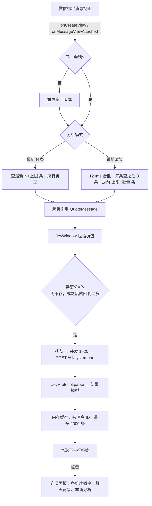
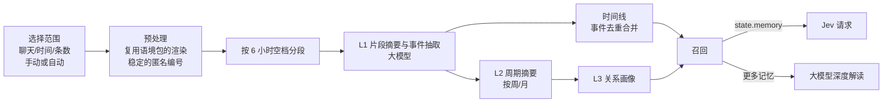

# Jev 二开：架构与关键决策

> 适用于 `D:\workspace\wa-jev`（WeKit 二开，`jev` 分支）。最后更新：2026-09-23。
> 本文说明"现在是什么样、为什么这样"。开发过程、评测方法和排查思路见同目录的《开发路径与方法论.md》。

## 1. 概述

Jev 是加在 WeKit（微信 Xposed 模块）里的一个聊天功能。它把收发的文本消息连同语境一起发给 TypeSafe 的 Jev 模型，在对应气泡下方显示一行分析标签；点开标签可以看到各个维度的概率。

- **目标效果**：对真实的收发文本消息（含引用回复），按真实消息 ID 把结果挂到对应气泡下。不用系统消息、假数据或固定评级代替。
- **维护原则**：所有代码都放在新文件里，**不修改任何上游文件**，跟进上游时不会产生文本冲突。
- **服务边界**：Jev 由用户自行配置 TypeSafe API Key。消息文本和选定的语境会发送给 TypeSafe。任何 Xposed 方案都不能承诺防封号。

## 2. 当前状态

| 项 | 状态 |
|---|---|
| 分支 | `jev`，基于上游 `bdc7f18`（2026-09-06）；首次提交 `f85deb42`，第一阶段的改动尚未提交 |
| 已实现 | 多维度分析：对方的消息分析阴阳怪气、调侃、网络黑话、敷衍、情绪；自己的消息分析回应、温度、语气，外加两项风险提示<br>结构化语境包：按对话段落截取、非文字占位符、引用回复、回复间隔、之后的回复、每个聊天的背景、全局补充说明<br>界面：一行标签、详情面板、在面板里设置聊天背景、单条重新分析 |
| 未实现 | 大模型深度解读、关系记忆层、发送前提醒、会话报告、结果持久化（见 §12） |
| 最新构建 | APK SHA-256 `1b7d1637ab1807d49069a8e478c9c20c29444e9e2d0ec64509e57b374db8823b`：单测 14/14 通过，完整 `./x build` 通过；**尚未真机验证** |
| 真机验证过的版本 | `631511d1…`（接手时的版本）、`04b1e7ea…`（零侵入改造后，用户确认可用） |

## 3. 工作区与构建

### 3.1 目录

| 路径 | 用途 |
|---|---|
| `D:\workspace\wa-jev` | **唯一的源码来源**（Windows） |
| WSL `/home/justhil/workspace/WeKit` | 构建镜像。在 Windows 文件系统上构建有问题，只在这里跑 `./x build`，不在这里改代码 |
| `D:\workspace\wa-jev-backup\20260923-154543\` | 接手时的改动补丁、未跟踪文件和旧 APK 的备份 |
| `jev-eval/` | 评测工具和样例；`results/` 已加入 `.gitignore`，只保存在本机 |
| `二开的参考文档/` | 本文和方法论文档 |

### 3.2 Jev 文件清单（全部是新增文件）

| 文件 | 职责 |
|---|---|
| `app/src/main/java/dev/ujhhgtg/wekit/features/items/chat/JevAnalysis.kt` | 运行时胶水代码：监听视图、读数据库、解析引用、请求队列、缓存、标签、面板、设置 |
| `…/chat/JevWindow.kt` | 纯逻辑：从数据库行组出语境包 |
| `…/chat/JevProtocol.kt` | 纯逻辑：定义题目、构造请求 JSON、解析响应、生成标签 |
| `app/src/main/res/values*/strings_jev.xml` | 设置界面文案（英文、简体、繁体） |
| `app/src/test/java/…/chat/JevProtocolTest.kt`、`JevWindowTest.kt` | 纯逻辑单测 |
| `jev-eval/jev_eval.py`、`samples.json` | 题目写法评测（第一、二轮） |
| `jev-eval/context_eval.py`、`context_samples.json` | 上下文组织方式评测（第三轮） |

Jev 的字符串不写进上游的 `strings.xml`：那三个文件上游改动很频繁，还接入了 Weblate 翻译。上游的 `xtask/src/i18n_check.rs` 只检查 `strings.xml`，而且 `./x build` 不会运行它。

### 3.3 构建流程

1. **在 Windows 仓库生成改动清单**：`git ls-files -m -o --exclude-standard > %TEMP%\wekit-jev-files.txt`
2. **同步到镜像**：`wsl bash wekit-sync-jev2.sh <清单> <Windows 的 HEAD>`。脚本会：
   - 校验两边 HEAD 一致；
   - 还原镜像里已不在清单中的改动；
   - 镜像里若有 Windows 侧没有的未跟踪文件，直接报错退出。
3. **单测**：`wekit-test-jev.sh`，即 `./gradlew :app:testStandardDebugUnitTest --tests '…chat.Jev*'`。这一步也会编译整个主工程。
4. **完整构建**：`wekit-build-jev.sh`，即 `./x build --flavor standard`。完成后把 APK 拷回 Windows 并比对 SHA-256。

注意事项：
- **必须走 `./x`**。直接用 Gradle 打包会带上旧的 Rust native 库。
- 镜像里的 `wekit-zygisk/native/.cargo/config.toml` 永远显示为已修改。它是 `./x configure` 按本机 NDK 生成的，**不要提交**。
- 以上三个脚本放在 `%TEMP%`，随时可能被清理，原文见附录 A。

**Windows 侧提交后，镜像要切到同一个提交**。用 bundle 传递，可以避开 WSL 访问 `/mnt/d` 仓库时的所有权检查：
```bash
# Windows（Git Bash）
git bundle create /c/tmp/jev.bundle <镜像已有的提交>..jev
# WSL 镜像
git fetch /mnt/c/tmp/jev.bundle jev:jev   # 已有 jev 分支时改用 git fetch … jev && git reset
git switch jev
```
如果镜像里的未跟踪副本挡住了切换，先逐个 `cmp` 确认它们和提交里的版本一致，再删除。

### 3.4 跟进上游

```bash
git fetch origin
git rebase origin/master      # 在 jev 分支上；Jev 全是新增文件，不会有文本冲突
```
rebase 后如果编译报错，说明上游改了 Jev 依赖的内部接口（见 §4.2），照着报错修改 Jev 即可。上游提交很频繁（截至 2026-09-23，近 30 天共 216 个提交），而且经常做大范围重构。镜像跟着更新时：先 `git restore wekit-zygisk/native/.cargo/config.toml`，再按 §3.3 的方法同步。

## 4. 运行时架构

### 4.1 在 WeKit 里的位置

- `JevAnalysis` 是一个 `ClickableFeature`，入口在"功能 → 聊天 → Jev 消息分析"，由 KSP 在编译期自动发现并注册，不需要改任何注册表。
- 开关状态以 `technicalId`（"Jev 消息分析"）为键保存（`SwitchFeature.kt`）。挪动包路径不影响开关；**改 `technicalId` 会让开关状态重置**。
- 默认只在微信主进程运行。

### 4.2 依赖的 WeKit 内部接口

上游改动下面任何一个接口，Jev 都可能编译失败。这是 fork 方案唯一的持续维护成本。

| 接口 | 用途 |
|---|---|
| `WeChatMessageViewApi`：`ICreateViewListener`、`IMessageViewLifecycleListener`、`findBoundViews`、`getBoundMessage`、`getMsgInfoFromParam`、`getChattingContextFromParam` | 消息视图的创建、绑定、挂载，以及真实消息 ID |
| `WeDatabaseApi`：`isReady`、`getMessages`、`executeQuery` | 读取聊天记录 |
| `WeApi.selfWxId` | 判断引用的是不是自己的话 |
| `MessageInfo`（`id`、`type`、`talker`、`isSelfSender`、`createTime`、`QuoteMessage`）、`MessageType`、`WeMessage` | 消息模型；`QuoteMessage` 用于解析引用 XML |
| `WePrefs`（`prefOption`、`getStringOrDef`、`putString`） | 配置存储（MMKV） |
| `ClickableFeature`、`FeatureCategoryIds` | 功能框架 |
| `showComposeDialog`、`AlertDialogContent`、`Button`、`TextButton` | 对话框 |
| `WeLogger`、`isDarkMode`、`isGroupChatWxId`、`stripWxId` | 日志和工具函数 |

### 4.3 三个文件的分工

```
JevAnalysis（运行时，依赖微信和 WeKit 运行时）
  ├─ 监听消息视图的创建和挂载 → 判断会话 → 选出要分析的消息
  ├─ 读数据库（所有消息类型，目标前后）→ 用 QuoteMessage 解析引用（native XML 解析器，桌面 JVM 上用不了）
  ├─ 请求队列、并发控制、版本失效、内存缓存
  └─ 气泡标签、详情面板、设置对话框
JevWindow（纯逻辑，可单测）
  └─ 数据库行 → 语境包：按段落截取、占位符、引用、截断、间隔、之后的回复、匿名发言人
JevProtocol（纯逻辑，可单测）
  └─ 题目定义 → 请求 JSON → 解析成结果模型 → 生成标签，判断是否用醒目颜色
```

引用 XML 的解析放在 `JevAnalysis`，解析结果以 `Map<msgId, JevQuote>` 的形式传给 `JevWindow`，这样 `JevWindow` 能保持纯逻辑、可以单测（见 ADR-9）。

### 4.4 数据流



### 4.5 两种分析模式

| 模式 | 何时规划 | 读多少数据 | 说明 |
|---|---|---|---|
| 进入聊天分析最新 N 条（默认） | 进入会话时规划一次 | 最新 `N + 上下文上限` 条，所有类型 | 滚动历史时只显示已有缓存，不发新请求；重新进入聊天时，之后回复变多的消息会重新分析 |
| 跟随渲染 | 消息视图出现在屏幕上时 | 每个候选：之后 3 条，之前 `上限 + 本批数量` 条 | 120ms 合批；候选最多 32 个，队列最多 50 个；请求发出前已离屏的直接跳过 |

### 4.6 缓存、失效与重新分析

- **缓存**：结果按消息 ID 存在内存 `LinkedHashMap` 里，最多 2000 条，重启微信后丢失。
- **重新分析**：每个结果都记录它用到了几条"之后的回复"（`afterCount`）。只有新规划出的任务 `afterCount` 更大时才重新请求（`needsAnalysis`）。跟随渲染模式下，`afterCount` 已经达到 3 的消息不会再规划。
- **失效**：
  - 更换密钥、修改上下文上限或补充说明：清空全部结果。
  - 修改某个聊天的背景：清空结果，丢弃进行中的任务，重新分析当前屏幕上属于这个聊天的消息。
  - 面板里点"重新分析"：只针对这一条。
- **切换会话**：`windowVersion` 和 `pending`（消息 ID → 版本）两者配合，防止切走后旧任务继续排队。已经发出的请求返回后仍会写入缓存（刻意保留，切回来可以直接显示）。

### 4.7 网络

- 使用 OkHttp：`callTimeout` 30 秒，不跟随重定向，`Authorization: Bearer <key>`。
- 失败时只记录异常类型或 HTTP 状态码，**目前不重试**，遇到 429/529 也不退避（见 §11）。

## 5. 语境包（请求中的 `state`）

```json
{
  "conversation": [
    {"from": "我", "text": "晚上一起吃饭？"},
    {"from": "对方", "text": "[图片]"},
    {"from": "我", "text": "这啥", "gap": "隔了 2 小时"}
  ],
  "target": {
    "from": "对方", "text": "呵呵",
    "quote": {"from": "我", "text": "我觉得你刚才说得不太对"},
    "gap": "隔了 40 分钟"
  },
  "relationship": "对方是我大学室友，平时说话很损",
  "note": "我说话比较直",
  "after": [{"from": "我", "text": "你什么意思？"}]
}
```

| 字段 | 规则（常量都在 `JevWindow`） |
|---|---|
| `conversation` | 从目标往前取。**目标前的那一条不管隔多久都保留**，因为迟到的回复仍然是在回应它；再往前遇到超过 6 小时的空档就停下，视为另一段对话。条数上限取设置值（0–200，默认 30）。离目标最近的 5 条每条最多 300 字，更早的最多 80 字 |
| 非文字消息 | 换成占位符：`[图片]`、`[语音]`、`[视频]`、`[表情包]`、`[位置]`、`[名片]`、`[链接]`、`[文件]`、`[转账]`、`[红包]`、`[通话]`、`[拍了拍]`、`[撤回了一条消息]`、`[系统消息]`、`[引用消息]`、`[卡片消息]`、`[其他消息]` |
| `target` | 文本消息或引用回复（引用回复取回复本身的文字），最多 4000 字 |
| `quote` | 引用回复被引用的那句话（最多 300 字；非文字时用占位符）。发送者按 `chatusr` 判断，没有时退回用 `fromusr`，再和 `WeApi.selfWxId` 比较 |
| `gap` | 与前一条消息间隔达到 30 分钟时标注，由代码算好（"隔了 N 分钟 / 小时 / 天"）。Jev 不擅长比较时间 |
| `after` | 目标之后最多 3 条回复，只有已经存在后续消息时才有 |
| `relationship` | 每个聊天单独设置的背景，在详情面板里填写，存为 `jev_relation_<talker>` |
| `note` | 全局补充说明，在设置里填写（沿用旧键 `jev_prompt`） |
| 发言人 | `我` / `对方` / `群成员N`。N 按本次读取范围内第一次出现的顺序编号，**不同请求之间不稳定**；不会发送 wxid |

## 6. 题目（请求中的 `questions`）

题目措辞**必须与 `jev-eval/` 里评测过的版本逐字一致**。改动任何一个字，都要先在评测里跑通，再同步回 `JevProtocol`（见 §13）。

对方的消息：

| ID | 类型 | 问什么 | 附带的判断标准 |
|---|---|---|---|
| `sarcasm` | noul | 是不是在阴阳怪气（用反话、嘲讽或假客气挖苦对方、表达不满） | 中文定义，外加 4 条正例、3 条反例 |
| `teasing` | noul | 是不是朋友间的善意调侃（没有真实敌意） | 中文定义，外加正反例 |
| `slang` | noul | 是否用了网络流行语、黑话、缩写或网络梗 | 例子：awsl、夺笋、破防、社死、芭比Q了 |
| `perfunctory` | noul | 是不是在敷衍（只用很少的字应付） | 明确说明：带嘲讽的反话不算敷衍 |
| `emotion` | choice | 真实情绪：平静、开心、感激、难过、不满、焦虑、其他 | "不满"的定义里**不写**"包括用反话表达的"（写了会把调侃判成不满） |

自己的消息：

| ID | 类型 | 问什么 |
|---|---|---|
| `respond` | score（3 档） | 在多大程度上回应了对方最后说的话 |
| `warmth` | score（3 档） | 给了对方多少温度和情绪支持 |
| `tone` | score（3 档） | 在这个情境下语气是否得体 |
| `cold` | noul | 对方会不会觉得冷淡、敷衍 |
| `sarcastic` | noul | 对方会不会觉得是在阴阳怪气、说反话 |

**字段点名**：state 里有 `target.quote`、`relationship`、`note`、`after` 中的任意几个时，把题目里的"结合 `conversation`"替换成"结合 `conversation`、`target.quote`（被引用的消息）……"。没有"结合 `conversation`"这几个字的题目，则在末尾追加一句"结合 …… 判断。"。只有 `conversation` 时，题目措辞保持原样。

## 7. 显示规则

| 对象 | 规则 |
|---|---|
| 反话类型 | 阴阳怪气概率 ≥ 0.5 且高于调侃概率 → 阴阳怪气；否则调侃概率 ≥ 0.5 → 调侃；否则不显示 |
| 阴阳怪气的两档 | ≥ 0.8 显示"阴阳怪气 94%"，0.5–0.8 显示"可能在说反话" |
| 对方消息的标签 | 最可能的情绪 · 反话类型 · 敷衍（仅当 ≥ 0.5 且阴阳怪气概率 < 0.5）· 含网络黑话（≥ 0.5），用" · "连接 |
| 自己消息的标签 | "回复 等级"：回应、温度、语气三项都归一到 0–1 后取平均，≥ 0.9 为 SSS，≥ 0.7 为 A，≥ 0.45 为 B，其余为 C。之后跟上最弱的一项（仅当 < 0.5，显示为"回应偏少 / 温度偏低 / 语气欠妥"）、"可能显得冷淡"（≥ 0.5）、"可能像阴阳怪气"（≥ 0.5） |
| 颜色 | 判为阴阳怪气，或自己的消息有任一项风险 ≥ 0.5 时用橙色（浅色模式 `#C26A1B`，深色模式 `#E0A15A`）；其余用灰蓝色（沿用原来的颜色） |
| 详情面板 | 对方的消息：阴阳怪气、调侃、情绪前三、敷衍、网络黑话的概率条<br>自己的消息：总评、三项得分、两项风险<br>底部：模型版本、token 数、参考了几条之后的回复<br>另有"这个聊天的背景"输入框（≤ 100 字，点确定后保存并重新分析）和"重新分析"按钮 |

标签和面板上的文字直接写在代码里，只有中文。设置界面的文案放在资源文件里，三种语言都有。

以上阈值都是临时值，依据的是合成样例的评测结果（见方法论文档），需要结合真实使用情况再调整。

## 8. 配置与存储

| 键 | 默认值 | 说明 |
|---|---|---|
| `jev_api_key` | 空 | TypeSafe API Key。**不要读取、打印或提交** |
| `jev_context_count` | 30 | 上下文条数上限（0–200），按对话段落截取 |
| `jev_latest_count` | 20 | 最新 N 条模式下的 N（1–200） |
| `jev_render_on_scroll` | false | 是否使用跟随渲染模式 |
| `jev_batch_limit` | 4 | 并发请求数（1–20） |
| `jev_prompt` | 空 | 全局补充说明（旧名"自定义提示词"，含义已改变） |
| `jev_relation_<talker>` | 空 | 每个聊天的背景 |

配置用 `WePrefs`（MMKV）保存，存储位置是宿主的私有目录 `filesDir/mmkv`。分析结果只保存在内存里。

## 9. 隐私与安全边界

- **发送给 TypeSafe 的内容**：目标消息；这段对话中上限以内的消息（文字按长度截断，其余只发占位符）；被引用的话；最多 3 条之后的回复；聊天背景和补充说明。不会发送 wxid、昵称或备注。
- **日志**：只记录状态、数量、异常类型和 HTTP 状态码，**不记录聊天原文和密钥**。排查时只筛选 `JevAnalysis:` 开头的行。日志位置：`/sdcard/Android/data/com.tencent.mm/WeKit/logs/wekit-YYYY-MM-DD.log`。
- **评测样例**：全部是虚构对话，不含真实聊天内容。评测脚本只从环境变量读取 key，不打印也不落盘。
- **需要用户授权的操作**：安装 APK、重启微信、推送代码、清理工作区。

## 10. 关键决策记录

| 编号 | 决策 | 原因与证据 | 代价 |
|---|---|---|---|
| ADR-1 | 放弃 WAuxiliary 的 BeanShell 插件路线，改为在 WeKit 上直接开发 | 插件接口没有"往气泡下挂视图"的能力，消息适配器取错，混淆后调试成本高；用户已明确放弃这条路 | 需要自己维护一个 fork |
| ADR-2 | fork 保持"零上游文件修改" | 上游的 `strings.xml` 各有 100 多次改动，`WeDatabaseApi.kt` 有 20 次。唯一的上游改动（一个查询）可以改用公开的 `executeQuery` 实现，字符串可以拆到独立文件 | 上游改内部接口时会编译失败，需要手动适配 |
| ADR-3 | 不做成 Python 插件、ExtensionPack、独立 Gradle 模块或独立 Xposed 模块 | Python 插件的 API 没有消息视图、数据库和设置能力，只能反射调内部接口（同样会随上游变动，只是从编译期报错变成运行时报错），另外还要装 Chaquopy 运行时，每条消息在主线程调一次 Python，并且这套插件引擎 2026-08-28 才引入。ExtensionPack 只是下载资源包的机制。`app` 是应用模块，其他模块无法依赖它。独立 Xposed 模块要自己做 Dex 解析 | 不能直接用上游官方构建的 APK，需要本地构建 |
| ADR-4 | 题目用中文写，加结构化正反例；"阴阳怪气"和"调侃"用两道是/否题再比大小 | 第二轮评测：这种做法准确率 0.92，阴阳怪气的精确率和召回率都是 0.94；三选一题只有 0.88，而且因为缺"敷衍"选项，会把"哦""哈哈"硬塞进某一类；英文题目在调侃、敷衍、情绪上都更差 | 多一道题（加题几乎不增加延迟和成本） |
| ADR-5 | 使用结构化 JSON 语境包，按段落截取，并带上引用和之后的回复 | 第三轮评测：手机上原来的做法 0.58 → 按段落取 0.74 → 再加关系和之后的回复 0.89；引用把一对样例从 0.24 提到 0.83；之后的回复把"辛苦了🙂"的风险从 0.10 提到 0.67 | 之后的回复变多时要重新分析，标签可能随之改变 |
| ADR-6 | 分两层：Jev 负责快速判断，大模型负责深入解读；大模型做成独立功能 | Jev 不生成文字，中文能力弱于英文；大模型能解释，但慢且贵。用户要求大模型部分做成独立功能：可以复用 WeAgent 的代码，但不依赖 WeAgent 功能本身 | 需要维护两套配置 |
| ADR-7 | 关系背景由用户手动填写，不自动读取微信备注和标签 | 用户的选择；自动读取会把备注名发送给第三方 | 需要用户自己动手 |
| ADR-8 | 分析结果暂时只存内存 | 第一阶段保持简单；会话报告和记忆层需要持久化时再做 | 重启微信后需要重新请求 |
| ADR-9 | 引用 XML 在运行时解析，`JevWindow` 只接收解析好的结果 | `QuoteMessage` 依赖 native XML 解析器，桌面 JVM 上跑不了；这样拆分同时也把"解码微信数据"和"组织语境"两件事分开了 | 多传一个参数 |
| ADR-10 | 改题目、改语境组织方式之前必须先评测 | 评测发现过措辞带偏结果的情况（敷衍题从 0.64 改到 0.92，情绪题里的反话条款把 0.97 拉低到 0.90） | 每次改动要多花几分钟、不到 1 美分 |

## 11. 已知限制与风险

- **🙂 盲区**：没有上下文时，"没关系呀🙂"会被判成真心（0.92）。🙂 在中文网络里的言外之意 Jev 不懂，目前要靠"之后的反应"来补救，以后可以交给大模型。
- **带梗的善意调侃**："栓Q，你是真的勇"的阴阳怪气概率是 0.81，和真正的阴阳怪气非常接近。
- **两人关系的作用有限**：只翻转成功一对（"大忙人"），另一对（"这都能搞丢"）没翻过来。
- **回复间隔**：方向正确（0.21 → 0.48），但没有越过 0.5 这个阈值。
- **评测数据本身的局限**：全部是合成样例，由一个人标注，数量少（第一、二轮 62 条，第三轮 19 条）。阈值只能算临时值。
- **官方说明**：Jev 的中文准确率低于英文，官方建议结合置信度做分流。
- **以下几点尚未经过真机验证**：
  - 引用 XML 里 `chatusr` 和 `fromusr` 的含义（单聊和群聊可能不同）；
  - 引用回复气泡的布局下，标签的挂载位置；
  - 标签能否正常响应点击；
  - 深色模式下的颜色；
  - 重新分析时标签会发生变化，用户是否接受。
- **没有重试**：遇到 429/529 不做退避，失败了只能等下次触发再分析。
- **群成员编号不稳定**：同一个人在不同请求里可能被编成不同的号，关系记忆层需要稳定的编号（见 §12.4）。
- **依赖面**：微信版本（消息视图 hook 依赖 WeKit 的 Dex 解析，适配 8.0.65–8.0.78）、数据库 `message` 表结构，以及 §4.2 列出的上游接口。

## 12. 路线图

### 12.1 第二阶段：大模型深度解读（独立功能，尚未实现）

- **形态**：和 Jev 平级的独立功能，有自己的开关和服务商配置。可以复用 `agent/model/OpenAiChatCompletionsClient`、`ModelProviderManager` 的代码，但**不要求 WeAgent 功能已开启或已配置**。
- **触发方式**：
  - 手动：详情面板里的"深度解读"按钮，或消息长按菜单（`WeChatMessageContextMenuApi`）；
  - 自动：当 Jev 判为"可能在说反话"（阴阳怪气 0.5–0.8）、阴阳怪气和调侃概率接近、网络黑话 ≥ 0.5，或结果置信度低时触发。
- **输入**：和 Jev 相同的语境包，可以带更长的上下文；接入记忆层以后再加上记忆（§12.4）。
- **输出**（固定 JSON 结构）：潜台词、黑话释义、语气判断及理由、2–3 条建议回复；如果是自己的消息，给出改写建议。
- **存储**：本地持久化，避免重复付费。

### 12.2 发送前提醒（尚未实现）

用 `WeChatInputBarApi.IInputBarListener.onTextChanged(chatFooter, text)` 拿到输入框里的草稿，停顿约 600ms 后，用"自己的消息"那组题目加上当前语境给草稿打分，在输入栏附近提示"可能显得冷淡 / 像阴阳怪气"。提示放在界面哪里、怎么挂上去，还需要调研。

### 12.3 会话报告与结果持久化（尚未实现）

把分析结果持久化（按消息 ID、题目版本、模型版本存储），然后按会话汇总对方的情绪走势和自己的回复质量趋势。这也是记忆层的前置条件之一。

### 12.4 关系记忆层（设计稿，暂不实现）

**要解决的问题**：语境包只覆盖"当前这段对话"，也就是 6 小时以内的内容。可两人之间的很多言外之意，来自更早的历史：上周刚吵过架、一个还没兑现的承诺、对方一向说话很损。第三轮评测已经证明，更早的争吵和两人关系都能改变判断，记忆层就是把这类信息系统地整理出来。



**分层结构**

| 层 | 内容 | 粒度 |
|---|---|---|
| L0 原始消息 | 微信数据库本身，是唯一的数据来源；记忆只是由它推导出来的缓存，拿不准时可以重新生成 | 条 |
| L1 片段 | 每段对话（按 6 小时空档切分）的摘要（≤ 80 字）、抽取出的事件、整体情绪、证据消息 ID | 段 |
| L2 周期 | 每周或每月的主题和变化，由 L1 汇总而来（map-reduce 方式） | 周 / 月 |
| L3 画像 | 关系类型和亲密程度、双方各自的说话习惯（比如"对方一向只回'哦'"）、常聊的话题、敏感话题和雷区、尚未了结的事（没兑现的承诺、没解决的矛盾） | 每个聊天一份 |
| 时间线 | 由 L1 事件去重合并而成，每个事件包含：时间、标题、细节、状态（未了结 / 已了结）、重要度 1–5、证据消息 ID | 事件 |

**分析范围**（可选）：按聊天选择；时间范围可选最近 N 天、最近 N 条、自定义起止时间或全部。执行之前先显示将要发送的消息条数、估算的 token 数和费用，用户确认后才发送。

**触发与更新**：
- 手动：在详情面板点"整理关系记忆"。
- 自动：可选。打开聊天时，如果距上次整理已有大量新消息，或已经隔了很多天，就触发。
- 增量：记录处理到哪条消息（水位线），之后只处理新的对话段；再把受影响的 L2、L3 连同旧版本一起交给模型滚动更新。
- 用户手工修改过的画像优先级高于自动生成的内容，重新生成时不能覆盖。

**召回逻辑**（给某一条目标消息，时间为 T）：
1. **画像**：总是带上，≤ 150 字。手动填写的聊天背景优先。
2. **近期事件**：T 之前 14 天内、重要度 ≥ 3 的事件，最多 5 条；外加所有未了结的事，最多 3 条。
3. **相关事件**：候选事件和当前对话、目标消息有关键词或实体重合时，按"相关度 × 时间衰减 × 重要度"排序，取前 3 条。还可以用 Jev 的是/否题做相关性过滤（官方的推荐做法，一个请求里可以批量问多道题）。
4. **总预算**：约 600 字，按时间先后排列。时间写成代码算好的相对时间（"3 天前""上周"）。**不召回 T 之后的事件**，避免分析历史消息时用到"未来"的信息。
5. **写入方式**：放进 `state.memory = {"profile": …, "events": [{"when": "3 天前", "what": …, "status": "未了结"}]}`，题目里点名"`memory`（两人过往）"。

**隐私**：生成记忆时，会把选定范围的聊天记录发给用户选择的大模型服务商。记忆只存在本地私有目录，可以查看、编辑、删除。Jev 请求只带召回出来的片段，不带原始历史。面板里要标明本次参考了哪些记忆。

**评测计划**（决定采用之前必须做）：扩展 `context_eval.py`，设计几类样例对比：
- 成对样例：只有记忆不同，比如同一句"挺好的，你去吧"，一组记忆是"上周因为出差吵过架"，另一组是中性内容；
- 干扰样例：放进无关记忆，不应该改变判断；
- 预算消融：只带画像、画像加近期事件、再加相关事件，分别比较。

只有提升明显、同时没有干扰副作用时才采用。

**会不会太复杂**：完整版确实复杂。它包括范围界面、三层摘要、事件抽取与合并、增量更新、召回、存储和评测，代码量估计上千行，而且有不少出错方式：模型编造事件、记忆过时、增量更新冲突、隐私。建议分步走：
- **MVP-1**：手动触发、单个聊天、选定范围；一次大模型调用，产出画像（≤ 150 字）和时间线（≤ 10 条事件）；本地存 JSON，面板里可以查看、编辑、删除。Jev 请求带上画像，以及近期和未了结的事件（最多 5 条，按规则召回，不做向量检索）。先用评测证明确实有用。
- **MVP-2**：增量更新（水位线）、生成 L1 片段摘要并合并进时间线。
- **MVP-3**：L2 周期摘要、相关性召回、自动触发。

**待定问题**：
- 选哪家大模型、成本多少、上下文能有多长；
- 群聊里多人的记忆怎么组织；
- 撤回和删除的消息怎么处理；
- 记忆过时后如何校正；
- 评测数据：真实聊天不能外传，需要构造长篇的合成历史。

## 13. 维护指南

**修改题目**：
1. 先在 `jev-eval/jev_eval.py` 里加一个新写法的变体，和旧写法放在同一个请求里对比；
2. 跑评测，确认新写法更好；
3. 把新措辞逐字同步到 `JevProtocol`；
4. 更新单测，完整构建，真机验证。

**修改语境组织方式**：先扩展 `context_eval.py`，补上成对样例并跑通，再改 `JevWindow`。

**新增维度**：在 `JevProtocol` 里加题目，同步修改结果模型、`parse`、标签和面板；标签只放最关键的信息，其余进面板。

**排查问题**：
1. 看真机日志里 `JevAnalysis:` 开头的行：`chat switched`、`window loaded/planned/queued`、`render first batch`、`first result bound/shown`、`request failed`、`API returned HTTP`、`invalid API response`、`failed to decode quote`；
2. 日志里出现 `shown=1` 只能说明代码走到了挂载这一步，标签位置对不对要看截图；
3. 需要复现请求时，用评测脚本构造同样的 state 发一次。

**不要做的事**：
- 修改上游文件；
- 在 `app/src/main` 里使用 `internal`；
- 读取或打印 API Key；
- 收集完整日志外传；
- 把"构建成功"说成"真机已验证"；
- 未经授权就安装、推送或清理工作区。

## 附录 A：构建脚本原文

`%TEMP%\wekit-sync-jev2.sh`：
```bash
#!/usr/bin/env bash
# usage: wekit-sync-jev2.sh <file-list> <windows-HEAD>
# <file-list>: output of `git ls-files -m -o --exclude-standard` in the Windows repo
set -euo pipefail
src=/mnt/d/workspace/wa-jev
dst="$HOME/workspace/WeKit"
list=$1
cd "$dst"
head=$(git rev-parse HEAD)
if [ "$head" != "$2" ]; then
  echo "HEAD mismatch: mirror $head, windows $2" >&2
  exit 1
fi
restore=$(git diff --name-only | grep -v '/\.cargo/config\.toml$' | grep -vxF -f "$list" || true)
if [ -n "$restore" ]; then
  echo "$restore" | xargs git checkout --
  printf 'restored:\n%s\n' "$restore"
fi
extra=$(git ls-files -o --exclude-standard | grep -vxF -f "$list" || true)
if [ -n "$extra" ]; then
  printf 'mirror has untracked files absent on Windows:\n%s\n' "$extra" >&2
  exit 1
fi
while IFS= read -r f; do
  mkdir -p "$(dirname "$f")"
  cp "$src/$f" "$f"
  cmp "$src/$f" "$f"
done < "$list"
git diff --check
git status --short
echo SYNC_OK
```

`%TEMP%\wekit-test-jev.sh`：
```bash
#!/usr/bin/env bash
set -euo pipefail
export JAVA_HOME=/usr/lib/jvm/java-21-openjdk-amd64
export ANDROID_HOME="$HOME/Android/Sdk"
export PATH="$JAVA_HOME/bin:$PATH"
cd "$HOME/workspace/WeKit"
mkdir -p build/jev-evidence
./gradlew :app:testStandardDebugUnitTest --tests 'dev.ujhhgtg.wekit.features.items.chat.Jev*' 2>&1 | tee build/jev-evidence/jev-test.log
for r in app/build/test-results/testStandardDebugUnitTest/TEST-dev.ujhhgtg.wekit.features.items.chat.Jev*.xml; do
  grep -o '<testsuite [^>]*' "$r" | grep -o 'name="[^"]*"\|tests="[0-9]*"\|failures="[0-9]*"\|errors="[0-9]*"' | paste -sd' '
done
echo JEV_TESTS_DONE
```

`%TEMP%\wekit-build-jev.sh`：
```bash
#!/usr/bin/env bash
set -euo pipefail
source "$HOME/.cargo/env"
export JAVA_HOME=/usr/lib/jvm/java-21-openjdk-amd64
export ANDROID_HOME="$HOME/Android/Sdk"
export PATH="$JAVA_HOME/bin:$ANDROID_HOME/platform-tools:$HOME/.cargo/bin:$PATH"
cd "$HOME/workspace/WeKit"
mkdir -p build/jev-evidence
./x build --flavor standard 2>&1 | tee build/jev-evidence/jev-build.log
apk=app/build/outputs/apk/standard/debug/app-standard-debug.apk
test -s "$apk"
out=/mnt/d/workspace/wa-jev/app/build/outputs/apk/standard/debug/app-standard-debug.apk
mkdir -p "$(dirname "$out")"
cp "$apk" "$out"
cmp "$apk" "$out"
sha256sum "$apk" "$out"
printf '\nJEV_BUILD_READY\n'
```

真机安装（需要用户授权）：
```bash
adb -s <序列号> install -r app/build/outputs/apk/standard/debug/app-standard-debug.apk
adb -s <序列号> shell am force-stop com.tencent.mm
adb -s <序列号> shell am start -n com.tencent.mm/.ui.LauncherUI
```
测试机（小米 14，微信 8.0.69）加载的是已安装的包本身，而不是 Zygisk 的 `module.apk` 副本，所以覆盖安装后重启微信即可生效。可以用手机上的 APK 哈希加上微信进程的启动时间来确认。

## 附录 B：参考资料

- TypeSafe 官方文档：https://docs.typesafe.ai（每个页面都有 `.md` 版本，索引在 `/llms.txt`）。重点页面：`/primitives`、`/primitives/choice`、`/primitives/score`、`/primitives/noul`、`/primitives/advanced`、`/concepts/state`、`/concepts/system-one`、`/concepts/how-to-build-with-system-one`、`/confidence`、`/models`、`/model-jaggedness/jev-1.13`、`/api`
- 本项目评测的原始结果（本机，不进 git）：`jev-eval/results/20260923-195103/`（第一轮）、`20260923-201305/`（第二轮）、`20260923-211940-context/`（第三轮）
- 上游：https://github.com/Ujhhgtg/WeKit ，项目约定见仓库根目录的 `AGENTS.md`
